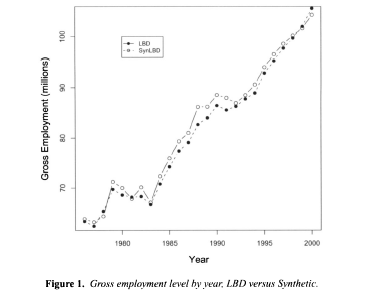
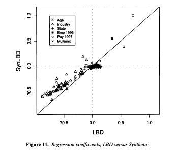

```{r setup, include=FALSE}
knitr::opts_chunk$set(echo = TRUE)
```

## Outline

\tableofcontents[hideallsubsections]


# Introduction

## What are synthetic data?

- To provide privacy protection of individuals in datasets

- Usually created by simulating variables of records from statistical models estimated on the confidential data

- Objective: preserve data integrity (e.g., important characteristics in the confidential data, such as means and correlations of variables)

\pause 

- To do so, we start with developing suitable statistical models for the confidential data

## How are synthetic created?

- If the developed statistical models are appropriate and model estimation is done properly, the estimated models can capture important characteristics in the confidential data

\pause 

- And synthetic records are simulated from these estimated models

- Then, these synthetic records could potentially preserve important features in the confidential data

\pause

- Moreover, they can provide some levels of privacy protection, as compared to releasing the confidential data


## What we will do in this lecture

- We will go over important aspects of any synthetic data approach
    - Two flavors of synthetic data: partial synthesis and full synthesis
    - Two general approaches to synthetic data creation: sequential synthesis and joint synthesis
    - Two aspects of evaluation: utility and disclosure risks

\pause

- Our course focuses on Bayesian synthesis models (Lectures 3 and 4)

- There also exist non-Bayesian data synthesis models (e.g., the \texttt{synthpop} R package)


# Partial synthesis and full synthesis

## Partial synthesis

- Proposed by @Little1993synthetic

- Some variables in the collected dataset, such as sensitive variables and key identifiers, are synthesized

- The resulting synthetic data contain sensitive variables with synthesized values while other variables remain unchanged

## Full synthesis

- Proposed by @Rubin1993synthetic

- A synthetic population is first simulated

- Then a synthetic sample is selected from the synthetic population

- The resulting synthetic data have every variable synthesized, contain no records from the confidential data, and it may even have a different sample size than the confidential data if needed

\pause

- One can also create fully synthetic data following the partial synthesis approach, i.e., only working on the sample
    - This approach is actually more widely used when creating fully synthetic data

## Comparisons

- The choice depends on data disseminator's protection goals

- Assuming a quality synthesis
    - Utility: higher in partially synthetic data
    - Disclosure risks: higher in partially synthetic data

- Utility-risk trade-off

## Example: SynLBD

SynLBD variable description. Taken from Table 1 in @Kinney2011ISR with some modifications.

| Name | Type |Notation | Action |
| :--- | :--- | :------- | :----- |
| ID   | Identifier | | Created |
| County | Categorical |  $x_1$| Not released |
| SIC | Categorical | $x_2$ | Not to synthesize |
| Firstyear | Categorical | $y_1$ | To synthesize |
| Lastyear | Categorical | $y_2$ | To synthesize |
| Year | Categorical | | Created |
| Multiunit | Categorical | $y_3$ | To synthesize |
| Employment | Continuous | $y_4$ | To synthesize |
| Payroll | Continuous | $y_5$ | To synthesize |

\pause

Partial synthesis or full synthesis?


# Sequential synthesis and joint synthesis

## The joint distribution of synthesized variables

- This classification is based on what strategy is used to estimate the joint distribution of the variables to be synthesized

- Variables to be synthesized: $\{y_1, y_2, y_3\}$

- Insensitive variables: $\{x_1, x_2\}$

- The joint distribution of synthesized variables

\begin{equation}
f(y_1, y_2, y_3 \mid x_1, x_2)
\end{equation}

\pause 

- How to estimate this joint distribution? Two general approaches


## Sequential synthesis overview

- This approach specifies a sequence of univariate synthesis models for the sensitive variables

- This sequence ultimately gives a joint model of all sensitive variables

\pause

- Variables to be synthesized: $\{y_1, y_2, \cdots, y_{p_1}\}$

- Insensitive variables: $\{x_1, x_2, \cdots, x_{p_2}\}$

- The joint model can be expressed in a sequence of univariate model as:
\begin{eqnarray*}
f(y_1, \cdots, y_{p_1} \mid x_1, \cdots, x_{p_2}) =
&& f(y_1 \mid x_1, \cdots, x_{p_2}) \times \\
&& f(y_2 \mid y_1, x_1, \cdots, x_{p_2}) \times \\
&& \cdots \\
&& f(y_{(p_1 - 1)} \mid y_1, \cdots, y_{(p_1 - 2)}, x_1, \cdots, x_{p_2}) \times  \\
&& f(y_{p_1} \mid y_1, \cdots, y_{(p_1 - 1)}, x_1, \cdots, x_{p_2}) \\
\end{eqnarray*}

## Sequential synthesis procedure

1. Specify a synthesis model for $y_1 \mid x_1, \cdots, x_{p_2}$. Estimate this model on the \textcolor{red}{confidential data}, and generate synthetic $y_1^*$ using confidential $(x_1, \cdots, x_{p_2})$.

2. Specify a synthesis model for $y_2 \mid y_1, x_1, \cdots, x_{p_2}$. Estimate this model on the \textcolor{red}{confidential data}, and generate synthetic $y_2^*$ using \textcolor{blue}{synthetic} $y_1^*$ from step 1 and confidential $(x_1, \cdots, x_{p_2})$. 

3. Repeat Step 2 for each of the variables of $\{y_3, \cdots, y_{(p_1 - 1)}\}$.

4. Specify a synthesis model for $y_{p_1} \mid y_1, \cdots, y_{(p_1 - 1)}, x_1, \cdots, x_{p_2}$. Estimate this model on the \textcolor{red}{confidential data}, and generate synthetic $y_{p_1}^*$ using \textcolor{blue}{synthetic} $(y_1^*, y_2^*, \cdots, y_{(p_1 - 1)}^*)$ from previous steps and confidential $(x_1, \cdots, x_{p_2})$.


## Joint synthesis 

- The joint distribution: $f(y_1, \cdots, y_{p_1} \mid x_1, \cdots, x_{p_2})$

- Directly specify a joint model for these sensitive variables

- For example, if $\{y_1, y_2, \cdots, y_{p_1}\}$ are all continuous (and marginally normal after transformation), we can use a multivariate normal distribution:
\begin{equation}
\begin{bmatrix}
y_1 \\ \vdots \\ y_{p_1}
\end{bmatrix}
\sim \textrm{MVN}_{p_1} \left(
\begin{bmatrix}
\mu_1 \\ \vdots \\ \mu_{p_1}
\end{bmatrix}
\Sigma
\right),
\end{equation}

    - $\textrm{MVN}_{p_1}$ stands for multivariate normal distribution of dimension $p_1$
    - $\mu_1, \cdots, \mu_{p_1}$ are the mean parameters (conditional on $x_1, \cdots, x_{p_2}$)
    - $\Sigma$ is covariance matrix

## Joint synthesis cont'd

- If sensitive variables are all categorical...

- A well research model is the Dirichlet Process mixture of products of multinomials (DPMPM) (@HuReiterWang2014PSD); we will introduce it in Lecture 4

- Joint synthesis model estimation is usually more challenging than sequential synthesis

\pause

- Bayesian networks are good approaches (@Young2009JOS, @Kaur2021JAMIA); this could be an interesting project

## Example: SynLBD

- Details are in @Kinney2011ISR Section 3

- The SynLBD uses the sequential synthesis approach

\pause

The sequential synthesis procedure for the SynLBD follows the workflow below:

1. Synthesize ```Firstyear``` using the Dirichlet-multinomial approach and draw from the following estimated model to obtain $y_1^*$
\begin{equation}
f(y_1 \mid x_1, x_2). 
\end{equation}

2. Synthesize ```Lastyear``` using the Dirichlet-multinomial approach and approximate a draw from the following estimated model to obtain $y_2^*$
\begin{equation}
f(y_2 \mid y_1, x_1, x_2). 
\end{equation}

## Example: SynLBD

3. Synthesize ```Multiunit``` using the Dirichlet-multinomial approach and approximate a draw from the following estimated model to obtain $y_3^*$
\begin{equation}
f(y_3 \mid y_2, y_1, x_1, x_2).
\end{equation}

4. Synthesize ```Employment``` using the normal approach and approximate a draw from the following estimated model to obtain $y_4^{(t)*}$
\begin{equation}
f(y_4^{(t)} \mid y_4^{(t-1)}, y_3, y_2, y_1, x_1, x_2).
\end{equation}

5. Synthesize ```Payroll``` using the normal approach and approximate a draw from the following estimated model to obtain $y_5^{(t)*}$
\begin{equation}
f(y_5^{(t)} \mid y_4^{(t)}, y_5^{(t-1)}, y_3, y_2, y_1, x_1, x_2). 
\end{equation}

# Evaluations of synthetic data

## Utility evaluation

- Two general types of utility: global and analysis-specific

1. Global utility: Evaluate the closeness between the confidential data distribution and the synthetic data distribution

2. Analysis-specific utility: Evaluate whether synthetic data users can obtain statistical inferences on the synthetic data that are similar to those obtained on the confidential data

\pause

- How to capture the uncertainty in the synthetic data generation process? Create multiple synthetic datasets

## Example: SynLBD

```{r, Employment-by-year, echo = FALSE, fig.align= 'center', out.width="70%"}

```

Global utility or analysis-specific utility?

## Example: SynLBD

```{r, Regression, echo = FALSE, fig.align= 'center', out.width="60%"}

```

Global utility or analysis-specific utility?

## Disclosure risks evaluation

- Assuming the intruder has access to external data, two common disclosure risks: identification and attribute (@Hu2019TDP)

1. Identification disclosure: The intruder correctly identifies records of interest in the released synthetic data

2. Attribute disclosure: The intruder correctly infers the true confidential values of the synthetic records using information from the released synthetic data

## Utility-risk trade-off

- Ideally, the released synthetic data have high utility and low disclosure risks

- However this is usually not the case, due to the utility-risk trade-off (@Duncan2001NISS)

```{r, RUmap, echo = FALSE, fig.align= 'center', out.width="70%"}
knitr::include_graphics("figures/RUMap_handdrawn.png")
```

# Summary and References

## Summary

- Synthetic data
    - Partial synthesis and full synthesis
    - Sequential synthesis and joint synthesis
    - Evaluations of synthetic data: utility and disclosure risks
    - The example of SynLBD
  
\pause

- Homework 1: Read @twophasePSD and answer a few questions regarding the discussed aspects of synthetic data
    - Submission on Moodle and prepare to discuss next time

\pause

- Lecture 2: Introduction to Bayesian modeling
    - Chapter 7 of @AlbertHu2019: https://bayesball.github.io/BOOK/proportion.html
    
    
## References {.allowframebreaks} 
