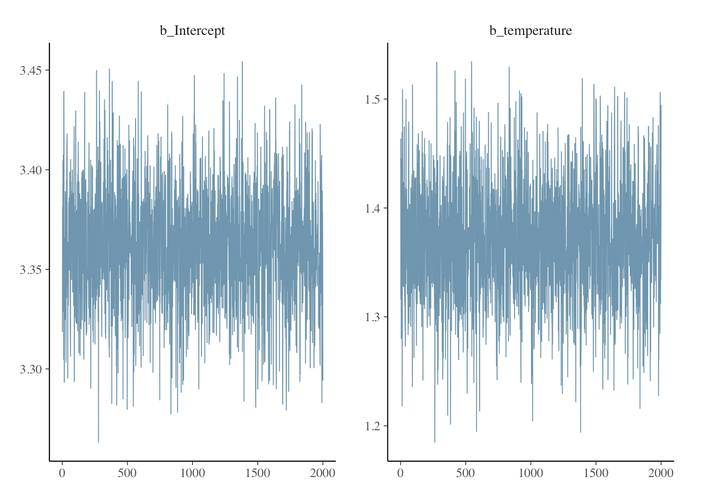

```{r setup, include=FALSE}
knitr::opts_chunk$set(echo = TRUE)
def.chunk.hook  <- knitr::knit_hooks$get("chunk")
knitr::knit_hooks$set(chunk = function(x, options) {
  x <- def.chunk.hook(x, options)
  ifelse(options$size != "normalsize", paste0("\\", options$size,"\n\n", x, "\n\n \\normalsize"), x)
})
```

```{r message = FALSE, echo = FALSE}
require(smoothmest)
require(dplyr)
require(readr)
require(ggplot2)
require(coda)
require(gridExtra)
require(brms)
require(bayesplot)
```

## Outline

\tableofcontents[hideallsubsections]


# Introduction

## Frequentist / classical and Bayesian inference

- Statistical inference aims to use data $\boldsymbol{Y}$ to learn about some unknown parameters $\boldsymbol{\theta}$

- Frequentist / classical inference:
    - Data $\boldsymbol{Y}$ are a repeatable random sample from a statistical model or a finite population
    - Underlying parameters $\boldsymbol{\theta}$ remain constant during this hypothetical repeatable process; considered fixed
    
\pause

- Bayesian inference:
    - Data $\boldsymbol{Y}$ are fixed; they are observed from the realized sample
    - Underlying parameters $\boldsymbol{\theta}$ are unknown, and can be described **probabilistically**
    
## Bayesian inference

- We can use probability distributions to describe the unknown underlying parameters $\boldsymbol{\theta}$

- These distributions represent our belief / knowledge about the values of the parameters

- The collected data can further sharpen / update our belief about the parameters

# The foundation of Bayesian inference

## The setup

- We will use a toy example of a coin flipping trial to introduce the foundation

- The outcome is either a head or tail

- The data / outcome is denoted as $Y$

- The parameter of interest is the probability of flipping a head, denoted as $\theta$

\pause

- The foundation topics include:
    - Prior
    - Likelihood
    - Bayes' rule (discrete and continuous) and posterior
  
  
## Prior

- Before observing the data, we may have certain beliefs about this unknown parameter $\theta$

- To describe our beliefs probabilistically

- Examples:
    - We know with certainty that this coin is fair: $\theta = 0.5$ with probability 1
    \pause
    - An unfair coin which turns up heads $30\%$ of the times: $\theta = 0.3$ with probability 1
    \pause
    - Really no idea and $\theta$ can be anywhere in [0, 1] with equal probability: $\theta \sim \textrm{Uniform}(0, 1)$
    \pause
    - Half the times $\theta = 0.3$ and half the times $\theta = 0.7$: $\theta = 0.3$ with probability 0.5 and $\theta = 0.7$ with probability 0.5
    

## Prior in Bayesian inference

- Bayesian inference combines our prior belief with the information contained in the collected data

- In our toy example:
    - Prior refers to our belief about $\theta$ before we start collecting data
    - Collecting data refers to the coin flipping trial
    - Posterior refers to out belief about $\theta$ after we collect and analyze our data
    
\pause

- \textcolor{blue}{Discussion question}: If we start with a fair coin prior belief, and we see an outcome of head, how would you use this collected data to update your belief? What if we see 5 heads in a row?
    
## Expressing a prior 

- Three examples of discrete prior for $\theta$:

| Value of $\theta$ | Case 1: $Pr(\theta)$ | Case 2: $Pr(\theta)$ | Case 3: $Pr(\theta)$ | 
| :--- | :------| :------| :------|
| 0.3 | 0.333... | 0.25 | 0.5  |
| 0.5 | 0.333... | 0.25 | 0.25 |
| 0.7 | 0.333... | 0.5  | 0.25 |

\pause

- Examples of continuous prior for $\theta$:
    - $\theta \sim \textrm{Uniform}(0, 1)$ (i.e., $\theta$ can be anywhere in [0, 1] with equal probability)

## Beta prior for $\theta$

- A common choice for continuous prior for $\theta \in [0, 1]$

- The probability density function of $\textrm{Beta}(a, b)$ is:

\begin{equation}
f(\theta) = \frac{\theta^{a - 1}(1 - \theta)^{b - 1}}{B(a, b)}, \theta \in [0, 1], a > 0, b > 0 ,
\end{equation}
where $B(a, b) = \Gamma(a) \Gamma(b) / \Gamma(a + b)$ and $\Gamma(\cdot)$ is the gamma function. The mean and variance of $\theta \sim \textrm{Beta}(a, b)$ are $a / (a + b)$ and $ab / ((a + b)^2 (a + b + 1))$ respectively.


## Three beta priors 

```{r eval = TRUE, echo = FALSE, fig.height = 4, fig.width = 6}
ggplot2::ggplot(data.frame(theta = c(0, 1)), aes(theta)) + 
  stat_function(fun = dbeta, args = list(shape1 = 1, shape2 = 1), 
                aes(color = "Beta(1, 1) = Uniform(0, 1)",
                    linetype = "Beta(1, 1) = Uniform(0, 1)")) +
  stat_function(fun = dbeta, args = list(shape1 = 8, shape2 = 2), 
                aes(color = "Beta(8, 2)", linetype = "Beta(8, 2)")) + 
  stat_function(fun = dbeta, args = list(shape1 = 2, shape2 = 8), 
                aes(color = "Beta(2, 8)", linetype = "Beta(2, 8)")) +
  scale_colour_manual(values = c("#0072B2", "#D55E00", "#CC79A7"),
                      guide = guide_legend(override.aes = list(
                        linetype = c(1, 2, 3)))) + 
  scale_linetype_manual(values = c(1, 2, 3), guide = FALSE) + 
  xlab(expression(theta)) + ylab("Density") +
  theme_bw(base_size = 15, base_family = "") +
  theme(legend.position = c(0.5, 0.8)) +
  theme(legend.title = element_blank())
```

## Comments on priors

- Bayesian inference is subjective

- Each person might have a different way to describe the underlying parameter $\theta$ probabilistically

- We can incorporate useful information about the unknown parameter $\theta$, if we do have such useful information

## Likelihood

- Bayesian inference combines our prior belief with the information contained in the collected data

- The collected data can be expressed as a model describing the distribution of the data as a function of the parameters

- We will refer to this data model as **likelihood**: a probability distribution of the data as a function of the parameters

## Review: the Bernoulli distribution

The probability mass function of $\textrm{Bernoulli}(\theta)$ is:

\begin{equation}
f(Y = y \mid \theta) = \theta^y (1 - \theta)^{1-y}, y = \{0, 1\}, \theta \in [0, 1]. 
\end{equation}

The mean and variance of $Y \sim \textrm{Bernoulli}(\theta)$ is $\theta$ and $\theta(1 - \theta)$ respectively.

## Bernoulli likelihood for $Y$

From this Bernoulli probability mass function, we can write our likelihood function as:

\begin{equation}
L(\theta) = \theta^y (1 - \theta)^{1-y}. 
\end{equation}

- The likelihood is a function of $\theta$ (recall in Bayesian inference, data are considered fixed and parameters are considered random)

- Bayes' rule will help us to combine prior and data to posterior

## Discrete Bayes' rule and posterior

- If we start with $\theta = \{0.3, 0.5, 0.7\}$ with equally probability of $0.333...$ for each, after seeing a flipped head, what are our updated probability of each of the possible values?

\pause

- The discrete Bayes' rule:
\begin{equation}
\pi(\theta = \theta_c \mid y) = \frac{f(y \mid \theta_c) \pi(\theta_c)}{\sum_j f(y \mid \theta_j) \pi(\theta_j)} = \frac{L(\theta_c) \pi(\theta_c)}{\sum_j L(\theta_j) \pi(\theta_j)},
\end{equation}
    - The denominator is the marginal probability of $y$ by the Law of Total Probability, i.e. $\sum_j L(\theta_j) \pi(\theta_j) = \sum_j f(y \mid \theta_j) \pi(\theta_j)  = f(y)$
    - $L(\theta_c)$ is our likelihood function of observing $y$ given $\theta_c$

\vspace{3mm}

- \textcolor{blue}{Discussion question}: Calculate the posterior probability of $\theta = 0.3$ after seeing one head (i.e., $y = 1$).

## Use R for posterior calculation

```{r size = "footnotesize"}
theta <- c(0.3, 0.5, 0.7)
y <- 1
likelihood <- stats::dbinom(x = y, size = 1, prob = theta)
likelihood
```

```{r size = "footnotesize"}
prior <- c(1/3, 1/3, 1/3)
product <- prior * likelihood
product
```

```{r size = "footnotesize"}
product / sum(product)
```

## The posterior

| Value of $\theta$ | $\pi(\theta)$ | $f(y \mid \theta)$ | $f(y \mid \theta)\pi(\theta)$| $\pi(\theta \mid y)$ | 
| :--- | :------| :------| :------|:------|
| 0.3 | 0.333... | 0.3 | 0.100 | 0.200 |
| 0.5 | 0.333... | 0.5 | 0.167... | 0.333... | 
| 0.7 | 0.333... | 0.7 | 0.233... | 0.467... |

## Continuous Bayes' rule and posterior

- If we start with a beta prior distribution for $\theta$, what is our posterior distribution for $\theta$ after seeing a flipped head? 

- The continuous Bayes' rule:
\begin{equation}
\pi(\theta \mid y) = \frac{f(y \mid \theta) \pi(\theta)}{\int_{\theta'} f(y \mid \theta') \pi(\theta') d\theta'} = \frac{L(\theta) \pi(\theta)}{\int_{\theta'} L(\theta') \pi(\theta') d\theta'}.
\end{equation}
    - The denominator is the marginal probability of $f(y)$, i.e. $\int_{\theta'} L(\theta') \pi(\theta') d \theta' = \int_{\theta'} f(y \mid \theta') \pi(\theta') d \theta' = \int_{\theta'} f(y, \theta') d \theta' = f(y)$, which is a constant since the data is fixed
    
\pause

- Typically we use this following version of the continuous Bayes' rule:
\begin{equation}
\pi(\theta \mid y) \propto f(y \mid \theta) \pi(\theta) = L(\theta) \pi(\theta).
\end{equation}

## The beta-binomial conjugacy

For a binomial data model where $Y \sim \textrm{Binomial}(n, p)$ and $p$ is the model parameter (the success probability), a $\textrm{Beta}(a, b)$ prior for $p$ gives a $\textrm{Beta}(a + y, b + n - y)$ posterior.

## Two beta priors and two beta posteriors

- Data: $y = 1$ (i.e., one trial and the outcome is a head)
- Prior 1: $\theta \sim \textrm{Beta}(2, 8)$; Posterior 1: $\theta \sim \textrm{Beta}(3, 8)$
- Prior 2: $\theta \sim \textrm{Beta}(8, 2)$; Posterior 2: $\theta \sim \textrm{Beta}(9, 2)$

```{r eval = TRUE, echo = FALSE, fig.height = 3.5, fig.width = 6}
ggplot2::ggplot(data.frame(theta = c(0, 1)), aes(theta)) + 
  stat_function(fun = dbeta, args = list(shape1 = 2, shape2 = 8), 
                aes(color = "prior1", linetype = "prior1")) + 
  stat_function(fun = dbeta, args = list(shape1 = 3, shape2 = 8), 
                aes(color = "posterior1", linetype = "posterior1")) +
  stat_function(fun = dbeta, args = list(shape1 = 8, shape2 = 2), 
                aes(color = "prior2", linetype = "prior2")) + 
  stat_function(fun = dbeta, args = list(shape1 = 9, shape2 = 2), 
                aes(color = "posterior2", linetype = "posterior2")) +
  scale_colour_manual(values = c("#0072B2", "#D55E00", "#0072B2", "#D55E00"),
                      guide = guide_legend(override.aes = list(
                        linetype = c(1, 1, 2, 2)))) + 
  scale_linetype_manual(values = c(1, 1, 2, 2), guide = FALSE) + 
  xlab(expression(theta)) + ylab("Density") +
  theme_bw(base_size = 15, base_family = "") +
  theme(legend.position = c(0.5, 0.8)) +
  theme(legend.title = element_blank())
```

## Recap: 3 general steps in Bayesian inference

1. **Prior $\pi(\theta)$**: Specify distributions for the parameters prior to seeing the data.

2. **Likelihood $L(\theta) = f(y \mid \theta)$**: Choose an appropriate data model for the data generation process and create the likelihood function expression.

3. **Posterior $\pi(\theta \mid y)$**: Use Bayes' rule to combine the prior and the data, and obtain the posterior distributions for the parameters. 

# Markov chain Monte Carlo: estimation and diagnostics

## MCMC overview

- Simple Bayesian models have analytical solution to the posterior (e.g., beta-binomial conjugacy)

- More sophisticated Bayesian models (e.g., more than one parameter) require more complicated posterior estimation methods

- The general class of posterior estimation methods is called Markov chain Monte Carlo (MCMC)

## MCMC estimation

- General strategy: design a Markov chain whose stationary distribution is the posterior distribution of interest

    - We set up a stochastic process which moves randomly in the space of parameters of our Bayesian model such that after a certain time, the process will produce samples from the posterior distribution of interest

    - At each iteration, the move of the process only depends on the value of the process at the previous iteration; therefore it is a Markov chain


(more details available at Chapter 9 of @AlbertHu2019: https://bayesball.github.io/BOOK/proportion.html)

## Gibbs sampler

- To obtain a draw from a multivariate posterior distribution

- The Gibbs sampler works by simply repeatedly sampling from the posterior distribution of each parameter, conditional on the remaining parameters (i.e., the full conditional posterior distribution)

## Gibbs sampler example

- A normal data model with mean $\mu$ and standard deviation $\sigma$ unknown

- Start with an appropriate prior $\pi(\mu, \sigma)$, we derive the two full conditional posterior distributions: $f(\mu \mid \sigma, Y)$ and $f(\sigma \mid \mu, Y)$

- Iteratively sample draws of $\mu$ and $\sigma$ in the following: at iteration $s + 1$
    
    1. Sample $\mu^{s+1} \sim f(\mu \mid \sigma^{s}, Y)$.
    2. Sample $\sigma^{s+1} \sim f(\sigma \mid \mu^{s+1}, Y)$.

## Gibbs sampler example cont'd

- After a certain number $S$ of iterative sampling is done, we can evaluate whether the chain has converged

- If so, the collective sampled draws of $\{\mu^1, \cdots, \mu^S\}$ are an approximation to the posterior distribution of $\mu$, and those of $\{\sigma^1, \cdots, \sigma^S\}$ are an approximation to the posterior distribution of $\sigma$

\pause

- Any posterior inferences on $\mu$ and $\sigma$ can then be obtained by summarizing these posterior draws

## Metropolis algorithm

- The Metropolis algorithm relies on making a proposal draw for the values of the parameters in the model, and evaluating whether we move to the proposal draw or stay at the current draw

## Metropolis algorithm example

- A normal data model with mean $\mu$ and standard deviation $\sigma$ unknown

- We illustrate the process for $\mu$ (updating of $\sigma$ follows a similar approach)

- A Metropolis algorithm has three general steps at iteration $s + 1$:

    1. Given the current simulated value $\mu^s$, we propose a new value $\mu^*$, selected at random from a uniform with width $2C$ (i.e. from the interval of $(\mu^s - C, \mu^s + C)$ or other symmetric distributions (e.g. normal centered at $\mu^s$).

    2. Compute the ratio $R$ of the posterior density (denoted as $\pi_n(\mu)$) at the proposed value $\mu^*$ and at the current value $\mu^s$: $R = \pi_n(\mu^*) / \pi_n(\mu^s)$; from this we obtain an acceptance probability of $p = \textrm{min}\{R, 1\}$.

    3. Simulate a uniform random variable from [0,  1], denoted as $U$. If $U < p$, we move to the proposed value $\mu^*$, and otherwise we stay at the current value $\mu^s$. 
    
    
## Hamiltonian Monte Carlo and Stan

- Not all models are amenable to Gibbs sampler or Metropolis algorithm, and in some cases these algorithms can take a long time to converge due to their random walk nature

- The Hamiltonian Monte Carlo (HMC) sampling algorithm is one of the more recent posterior sampling algorithms that is gaining popularity

\pause

- In this course, we use the ```brms``` R package to estimate Bayesian models for statistical data privacy purposes, most often for generating synthetic data

- The ```brms``` package relies on HMC

- The estimation output will return the complete sequence of draws for each of the parameters in the model

## MCMC diagnostics for convergence

- The obtained posterior draws from MCMC estimation can be used for posterior inference only once we can confirm that they serve as a good approximation to the true posterior distribution (i.e., enough iterations have occurred for the MCMC to have converged to the true posterior)

- While no test can guarantee that the MCMC has indeed converged to its stationary distribution, we can use several diagnostic tools to identify obvious issues showing that the MCMC has **not** converged

## Traceplots and autocorrelation plots


- A converged MCMC should include posterior parameter draws that have extensively explored the parameter space and are relatively independent from each other

- We can check by using **traceplots**: plot the parameter values against each MCMC iteration number

- We can also check by using **autoccorelation plots** to see if the posterior draws are relatively independent from each other

## Traceplots example

```{r, traceplot, echo = FALSE, fig.align= 'center', out.width="90%"}

```

## Autocorrelation plots example

```{r, autocorrelationplot, echo = FALSE, fig.align= 'center', out.width="90%"}
knitr::include_graphics("autocorrelationplots.png")
```

## Burn-in, thinning, and multiple MCMC chains

- Suppose the MCMC has been run for $S$ iterations

- **Burn-in**: After iteration $S^*$ (at which point we believe the chain has converged), we discard all draws before this iteration; this period is called the burn-in period; inference will only be using the remaining $S - S^*$ draws

\pause

- **Thinning**: To get rid of the autocorrelation between the draws, we can keep one of every $k-$th sample, e.g., $k = 10$; this procedure is called thinning; inference will only be using the remaining $(S - S^*) / k$ draws

\pause

- Run multiple chains at different starting points to see if they arrive at a similar sample space

## A brms example

- We will learn this example in the next lecture

- \textcolor{blue}{Discussion question}: Identify $S$, $S^*$, $k$ and the number of MCMC chains.

```{r eval = FALSE, size = "footnotesize"}
PoissonReg_fit <- brms::brm(data = bikesharing_data,
                            family = poisson(link = "log"),
                            count ~ 1 + temperature,
                            prior = c(prior(normal(0, 10), 
                                            class = Intercept),
                                      prior(normal(0, 10), class = b)),
                            iter = 5000, 
                            warmup = 3000, 
                            thin = 1, 
                            chains = 1, 
                            seed = 123)
```


# Summary and References

## Summary

- The foundation of Bayesian inference
    - Prior
    - Likelihood
    - Bayes' rule (discrete and continuous) and posterior
    
\pause

- Markov chain Monte Carlo (MCMC)
    - Estimation
    - Diagnostics
    
\pause

- Homework 2: a few derivation and R programming exercises
     - Submission on Moodle and prepare to discuss next time

- Lecture 3: Introduction to Bayesian modeling part 2
    - Chapter 11 of @AlbertHu2019: https://bayesball.github.io/BOOK/proportion.html (a different MCMC software is used)
    
## References {.allowframebreaks} 
